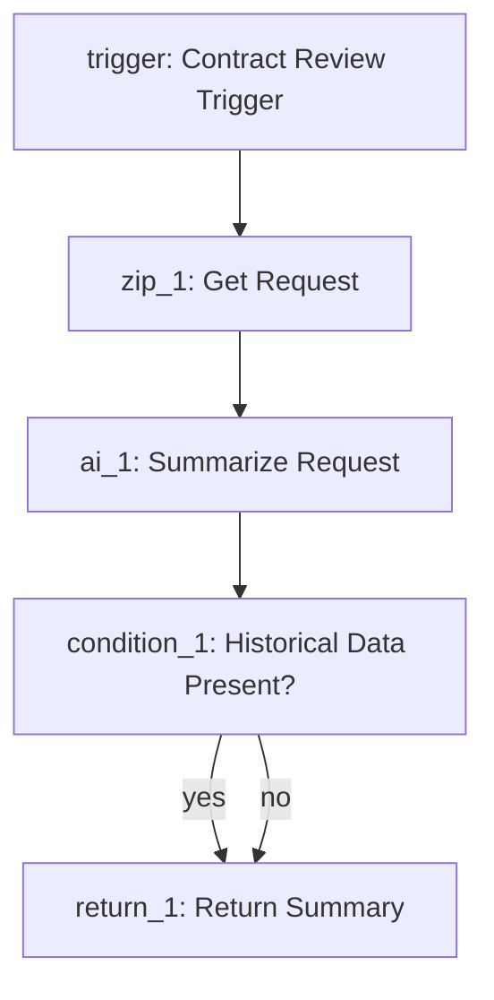

# 🎯 FEATURE(mdx_planning)

## Objective
Upgrade Planning Mode from a plain-text checklist into a deterministic `.mdx` planning artifact that documents and visualizes the future Zip agent before build mode runs. The generated MDX must follow the `PLAN copy.MD` structure, support reopening and revision in Planning Mode, and give Builder Mode enough structured business context to build the agent from the plan itself.

---

## Phase 1: Introduce a Deterministic MDX Plan Contract

**Justification:** The current planner saves arbitrary markdown text. That is not strong enough for iteration plus reliable build handoff. The minimal fix is a strict MDX template whose overview, table, and flow diagram give Builder Mode the business keys, types, values, and prompting logic it needs. Planning Mode should describe the workflow; Builder Mode should own syntax and final JSON construction.

### Action 1.1: Add the MDX Plan Helper
#### Target File: `src/planning/mdx-plan.ts`
#### Target Block: New file
**Action & Code:** Add a pure helper module that validates a business-level planning draft and renders the PLAN copy-style MDX sections. Keep file I/O, builder syntax generation, and tool execution out of this module.
```typescript
import { z } from "zod";

export const SECTION_TITLES = {
    overview: "Agent Overview",
    nodeFlow: "Node Flow Table",
    flowDiagram: "Flow Diagram",
    justifications: "Justifications",
    futureEnhancements: "Future Enhancement Notes",
} as const;

export const REQUIRED_PLAN_SECTIONS = Object.values(SECTION_TITLES);

const PlanNodeIdSchema = z.string().regex(
    /^[a-zA-Z0-9_-]+$/,
    "nodeId must contain only letters, numbers, underscores, or hyphens for valid Mermaid rendering."
);

const PlanNodeSchema = z.object({
    nodeType: z.string().describe("Business-level category (e.g., trigger, ai, condition)"),
    nodeName: z.string(),
    nodeId: PlanNodeIdSchema,
    purpose: z.string(),
    keysTypesValues: z.string(),
    promptOrLogic: z.string(),
});

const PlanEdgeSchema = z.object({
    from: PlanNodeIdSchema,
    to: PlanNodeIdSchema,
    label: z.string().trim().optional().transform(v => v === "" ? undefined : v),
});

export const AgentPlanDraftSchema = z.object({
    agentName: z.string(),
    purpose: z.string(),
    outputFilename: z.string(),
    nodeFlow: z.array(PlanNodeSchema).min(1),
    flowEdges: z.array(PlanEdgeSchema),
    justifications: z.array(z.string()).default([]),
    futureEnhancements: z.array(z.string()).default([]),
}).superRefine((plan, ctx) => {
    const nodeIds = plan.nodeFlow.map((node) => node.nodeId);
    const uniqueNodeIds = new Set(nodeIds);

    if (uniqueNodeIds.size !== nodeIds.length) {
        ctx.addIssue({ code: z.ZodIssueCode.custom, message: "nodeFlow contains duplicate nodeId values." });
    }

    if (plan.nodeFlow.length > 1 && plan.flowEdges.length === 0) {
        ctx.addIssue({ code: z.ZodIssueCode.custom, message: "flowEdges must not be empty when nodeFlow contains more than one node." });
    }

    for (const edge of plan.flowEdges) {
        if (!uniqueNodeIds.has(edge.from) || !uniqueNodeIds.has(edge.to)) {
            ctx.addIssue({
                code: z.ZodIssueCode.custom,
                message: `flowEdges reference unknown nodeId: ${edge.from} -> ${edge.to}`,
            });
        }
    }
});

export type AgentPlanDraft = z.infer<typeof AgentPlanDraftSchema>;
export type PlanNode = AgentPlanDraft["nodeFlow"][number];
export type PlanEdge = AgentPlanDraft["flowEdges"][number];

const escapeTableCell = (value: string) => value.replace(/\|/g, "\\|").replace(/\r?\n/g, "<br>");
const escapeMermaidLabel = (value: string) => value.replace(/"/g, "'");

const renderSection = (title: string, lines: string[]) => [
    `## ${title}`,
    "",
    ...lines,
    "",
    "---",
    "",
].join("\n");

export function normalizePlanFilename(filename: string): string {
    const safeBase = filename.trim().replace(/\.mdx?$/i, "").replace(/[^a-zA-Z0-9_-]/g, "");
    if (!safeBase) {
        throw new Error("Plan filename must contain at least one letter, number, underscore, or hyphen.");
    }
    return `${safeBase}.mdx`;
}

export function parseAgentPlanDraft(input: unknown): AgentPlanDraft {
    return AgentPlanDraftSchema.parse(input);
}

export function addNodeRow(
    planInput: AgentPlanDraft,
    nodeInput: PlanNode,
    options: { position?: number; edges?: PlanEdge[] } = {}
): AgentPlanDraft {
    const plan = parseAgentPlanDraft(planInput);
    const node = PlanNodeSchema.parse(nodeInput);

    if (plan.nodeFlow.some((existing) => existing.nodeId === node.nodeId)) {
        throw new Error(`Cannot add node. nodeId already exists: ${node.nodeId}`);
    }

    const position = options.position ?? plan.nodeFlow.length;
    if (position < 0 || position > plan.nodeFlow.length) {
        throw new Error(`Cannot add node. position out of bounds: ${position}`);
    }

    const nodeFlow = [
        ...plan.nodeFlow.slice(0, position),
        node,
        ...plan.nodeFlow.slice(position)
    ];

    // Deduplicate edges to prevent nested rendering loops in mermaid
    const rawEdges = [...plan.flowEdges, ...(options.edges ?? [])];
    const uniqueEdges = Array.from(new Set(rawEdges.map(e => JSON.stringify(e))))
        .map(e => JSON.parse(e) as PlanEdge);

    return parseAgentPlanDraft({
        ...plan,
        nodeFlow,
        flowEdges: uniqueEdges,
    });
}

export function updateNodeRow(
    planInput: AgentPlanDraft,
    nodeId: string,
    patch: Partial<Omit<PlanNode, "nodeId">>,
    options: { edges?: PlanEdge[] } = {}
): AgentPlanDraft {
    const plan = parseAgentPlanDraft(planInput);
    const index = plan.nodeFlow.findIndex((node) => node.nodeId === nodeId);

    if (index === -1) {
        throw new Error(`Cannot update node. Unknown nodeId: ${nodeId}`);
    }

    const updatedNode = PlanNodeSchema.parse({
        ...plan.nodeFlow[index],
        ...patch,
        nodeId,
    });

    const nodeFlow = [
        ...plan.nodeFlow.slice(0, index),
        updatedNode,
        ...plan.nodeFlow.slice(index + 1)
    ];

    const rawEdges = options.edges ?? plan.flowEdges;
    const uniqueEdges = Array.from(new Set(rawEdges.map(e => JSON.stringify(e))))
        .map(e => JSON.parse(e) as PlanEdge);

    return parseAgentPlanDraft({
        ...plan,
        nodeFlow,
        flowEdges: uniqueEdges,
    });
}

export function removeNodeRow(
    planInput: AgentPlanDraft,
    nodeId: string,
    options: { reconnectEdges?: PlanEdge[] } = {}
): AgentPlanDraft {
    const plan = parseAgentPlanDraft(planInput);

    if (!plan.nodeFlow.some((node) => node.nodeId === nodeId)) {
        throw new Error(`Cannot remove node. Unknown nodeId: ${nodeId}`);
    }

    if (plan.nodeFlow.length === 1) {
        throw new Error("Cannot remove node. A plan must contain at least one node.");
    }

    const rawEdges = [
        ...plan.flowEdges.filter((edge) => edge.from !== nodeId && edge.to !== nodeId),
        ...(options.reconnectEdges ?? []),
    ];
    const uniqueEdges = Array.from(new Set(rawEdges.map(e => JSON.stringify(e))))
        .map(e => JSON.parse(e) as PlanEdge);

    return parseAgentPlanDraft({
        ...plan,
        nodeFlow: plan.nodeFlow.filter((node) => node.nodeId !== nodeId),
        flowEdges: uniqueEdges,
    });
}

function renderOverview(plan: AgentPlanDraft): string {
    return renderSection(SECTION_TITLES.overview, [
        `**Agent Name:** ${plan.agentName}`,
        `**Purpose:** ${plan.purpose}`,
        `**Output Filename:** ${plan.outputFilename}`,
    ]);
}

function renderNodeFlowTable(plan: AgentPlanDraft): string {
    return renderSection(SECTION_TITLES.nodeFlow, [
        "| Node Type | Node Name | Node ID | Purpose | Keys / Types / Values | Prompt / Logic |",
        "| :--- | :--- | :--- | :--- | :--- | :--- |",
        ...plan.nodeFlow.map((node) =>
            `| ${escapeTableCell(node.nodeType)} | ${escapeTableCell(node.nodeName)} | \`${escapeTableCell(node.nodeId)}\` | ${escapeTableCell(node.purpose)} | ${escapeTableCell(node.keysTypesValues)} | ${escapeTableCell(node.promptOrLogic)} |`
        ),
    ]);
}

function renderFlowchart(plan: AgentPlanDraft): string {
    const labels = new Map(plan.nodeFlow.map((node) => [node.nodeId, `${node.nodeId}: ${node.nodeName}`]));
    return [
        "```mermaid",
        "flowchart TD",
        ...plan.flowEdges.map((edge) => {
            const fromLabel = escapeMermaidLabel(labels.get(edge.from) ?? edge.from);
            const toLabel = escapeMermaidLabel(labels.get(edge.to) ?? edge.to);
            const branch = edge.label ? ` -->|${escapeMermaidLabel(edge.label)}| ` : " --> ";
            return `    ${edge.from}[${fromLabel}]${branch}${edge.to}[${toLabel}]`;
        }),
        "```",
    ].join("\n");
}

function renderFlowDiagram(plan: AgentPlanDraft): string {
    return renderSection(SECTION_TITLES.flowDiagram, [renderFlowchart(plan)]);
}

function renderNumberedSection(title: string, items: string[], fallback: string): string {
    const lines = items.length ? items.map((item, index) => `${index + 1}. ${item}`) : [`1. ${fallback}`];
    return renderSection(title, lines);
}

export function renderAgentPlanMdx(input: unknown): string {
    const plan = parseAgentPlanDraft(input);

    return [
        `# PLAN.MDX - ${plan.agentName}`,
        "",
        renderOverview(plan),
        renderNodeFlowTable(plan),
        renderFlowDiagram(plan),
        renderNumberedSection(SECTION_TITLES.justifications, plan.justifications, "Keep the plan artifact executable and reviewable before build mode runs."),
        renderNumberedSection(SECTION_TITLES.futureEnhancements, plan.futureEnhancements, "None."),
    ].join("\n");
}
```

**Template Definition and Generation Rules:**
1. The template is defined in one place: `src/planning/mdx-plan.ts`.
2. The public API stays small: `normalizePlanFilename`, `parseAgentPlanDraft`, `addNodeRow`, `updateNodeRow`, `removeNodeRow`, and `renderAgentPlanMdx`.
3. Planning Mode does not hand-write markdown sections directly. It produces a business-level `AgentPlanDraft` object.
4. `saveAgentPlan` validates that object with `parseAgentPlanDraft(...)` and passes it into `renderAgentPlanMdx(...)`.
5. `renderAgentPlanMdx(...)` deterministically generates each MDX section through small section render helpers:
   - `## Agent Overview` ← `agentName`, `purpose`
   - `## Node Flow Table` ← `nodeFlow`
   - `## Flow Diagram` ← `nodeFlow`, `flowEdges`
   - `## Justifications` ← `justifications`
   - `## Future Enhancement Notes` ← `futureEnhancements`
6. The Node Flow Table is the primary builder-facing contract: each row must include purpose, business logic, and the keys/types/values the builder needs to translate into exact syntax.
7. Row-level iteration helpers also live here: `addNodeRow(...)`, `updateNodeRow(...)`, and `removeNodeRow(...)` update `nodeFlow` while keeping `flowEdges` explicit and validation-backed.
8. Those row helpers are internal pure utilities for deterministic plan transformations; they are not planner tools.
9. Semantic validation also lives here: duplicate node IDs are rejected, multi-node plans must define `flowEdges`, and graph edges must reference valid nodes.
10. Because generation is deterministic, the same planning draft always produces the same section order and layout.

### Action 1.2: Lock the Editability Contract to the MDX Template
#### Target File: `src/planning/mdx-plan.ts`
#### Target Block: New file, below `REQUIRED_PLAN_SECTIONS`
**Action & Code:** Export explicit template metadata so implementation and prompts agree on the required sections and treat the saved MDX file itself as the working plan artifact. Row-level edits should be expressed through the helper functions above rather than ad hoc array mutation.
```typescript
export const PLAN_FILE_IS_AUTHORITATIVE = true;
export const PLAN_TEMPLATE_VERSION = 1;
```

**Editability Rules:**
1. The saved MDX file is the authoritative review and iteration artifact.
2. `saveAgentPlan` always regenerates the entire MDX file from the planning draft; it does not patch individual sections in place.
3. On revision, Planning Mode reads the saved MDX source with `readAgentPlan(filename)`, reconstructs the full `planDraft` in-model from the visible sections, applies the requested changes, and then calls `saveAgentPlan(filename, planDraft)`.
4. These sections are regenerated on every save and may be overwritten even if a human edited them manually:
   - `## Agent Overview`
   - `## Node Flow Table`
   - `## Flow Diagram`
   - `## Justifications`
   - `## Future Enhancement Notes`
5. `Node ID` is the stable identity key for row-level iteration in `## Node Flow Table`.
6. Row-level iteration rules are explicit:
   - **Add node:** add a new row with a new `Node ID`, then add or update related `flowEdges`
   - **Update node:** keep the same `Node ID`, modify one or more row columns, and adjust `flowEdges` only if routing changed
   - **Remove node:** delete the row for that `Node ID` and remove or reconnect related `flowEdges`
7. Reordering rows does not rename nodes. A `Node ID` change is treated as remove-old/add-new unless explicitly handled as a rename in the planning draft.
8. `addNodeRow(...)` throws when `position` is out of bounds.
9. `removeNodeRow(...)` throws if removal would leave the plan with zero nodes.
10. There is no hidden builder-only JSON block. Builder Mode reads the same human-readable sections a human reviewer reads.
11. Builder Mode is responsible for translating the plan into exact tool syntax and final `task_template` JSON.
12. The table and Mermaid diagram must always describe the same workflow state.

### Action 1.3: Show an Example of the Generated MDX Output
#### Target File: `FEATURE(mdx_planning).md`
#### Target Block: This feature doc, directly below the editability rules
**Action & Code:** Include a short illustrative example so implementation reviewers can see the full generated template produced by `renderAgentPlanMdx`. The example should match the current renderer output and stay at the business-logic level rather than showing builder syntax.
````md
## Example Generated Output (Illustrative Example)

## Agent Overview

**Agent Name:** Contract Review Assistant
**Purpose:** Review request and vendor documents, identify risk signals, branch when historical documents exist, and return a structured summary for approval.
**Output Filename:** contract_review_assistant.json

## Node Flow Table

| Node Type | Node Name | Node ID | Purpose | Keys / Types / Values | Prompt / Logic |
| :--- | :--- | :--- | :--- | :--- | :--- |
| trigger | Contract Review Trigger | `trigger` | Entry point for the workflow. | `trigger_type: APPROVAL_ASSIST` | Standard approval-assist entry trigger. |
| zip | Get Request | `zip_1` | Fetch the request payload and attachments. | `request_id: string`<br>`attachments: file[]` | Retrieve the request body and attached documents for downstream analysis. |
| ai | Summarize Request | `ai_1` | Analyze request documents and summarize the work needed. | `input_docs: file[]`<br>`summary: string`<br>`hasHistoricalDocs: boolean` | Extract key obligations, risks, and deliverables from the current request documents. |
| condition | Historical Data Present? | `condition_1` | Branch based on whether previous documents exist. | `condition: boolean` | Route to the historical branch only when prior documents are available. |
| return | Return Summary | `return_1` | Return the final structured summary. | `value: string` | Return the user-facing summary result. |

## Flow Diagram



## Justifications

1. Separate the request retrieval step from the AI summarization step so the workflow remains auditable.
2. Keep the condition step explicit so reviewers can see where historical-document logic affects the workflow.

## Future Enhancement Notes

1. Add a dedicated historical-document retrieval branch if prior contracts need separate summarization.
````

**Example Rules:**
1. This example is illustrative only; the real saved MDX file is the working plan artifact.
2. The real saved plan must still regenerate all required sections from the planning draft.
3. The table and Mermaid chart must stay structurally aligned: every displayed node and edge must come from `nodeFlow` and `flowEdges`.
4. The `Keys / Types / Values` column is what Builder Mode uses to translate business intent into exact syntax.
5. Row-level iteration is keyed by `Node ID`: keep it stable for updates, use a new one for added nodes, and remove it entirely for deleted nodes.

---

## Phase 2: Upgrade Planning Tools from Freeform Markdown to MDX Artifact IO

**Justification:** The current `saveAgentPlan` writes arbitrary `.md` content and Builder Mode has no reliable planning artifact to work from. The smallest complete feature is: planner writes validated `.mdx`, planner can reload that same file for iteration, and builder reads that same `.mdx` as its build brief.

### Action 2.1: Import the Helper in Tooling
#### Target File: `src/tools.ts`
#### Target Block: Lines 5-10
**Action & Code:** Add the MDX plan helper import.
```typescript
import { z } from "zod";
import { promises as fs } from "fs";
import path from "path";
import { StepBuilder } from "./builders/StepBuilder.js";
import { AgentBuilder } from "./builders/AgentBuilder.js";
import { ZipBuilderConfig } from "./config.js";
import { AgentPlanDraftSchema, normalizePlanFilename, renderAgentPlanMdx } from "./planning/mdx-plan.js";
```

### Action 2.2: Replace Freeform Plan Save with Iteration-Safe MDX Save + Read
#### Target File: `src/tools.ts`
#### Target Block: Lines 581-602
**Action & Code:** Replace the current markdown-only save tool with MDX save/read tools. `saveAgentPlan` must safely overwrite an existing file so the planner can iterate on the same artifact, and `readAgentPlan` only needs to return the saved source text for planner/builder interpretation. Planning Mode reconstructs the revised `planDraft` in-model from that source before saving.
```typescript
        // ── Planning Mode Storage ──────────────────────────────────────────────────

        saveAgentPlan: {
            name: "saveAgentPlan",
            description: "Validates a planning draft, renders it as MDX, and creates or overwrites a plan file in the configured plan directory.",
            parameters: z.object({
                filename: z.string().describe("Plan filename without extension"),
                planDraft: AgentPlanDraftSchema.describe("Business-level planning draft used to render the MDX plan"),
            }).shape,
            execute: async ({ filename, planDraft }: { filename: string; planDraft: any }) => {
                try {
                    const mdx = renderAgentPlanMdx(planDraft);
                    const planDir = path.resolve(process.cwd(), config.planDir);
                    await fs.mkdir(planDir, { recursive: true });
                    const fullPath = path.join(planDir, normalizePlanFilename(filename));
                    await fs.writeFile(fullPath, mdx, "utf-8");
                    return { success: true, filepath: fullPath };
                } catch (e) {
                    return { success: false, error: (e as Error).message };
                }
            },
        },

        readAgentPlan: {
            name: "readAgentPlan",
            description: "Reads a saved MDX plan and returns the rendered source for review, planner-side reconstruction of planDraft, or build translation.",
            parameters: z.object({
                filename: z.string().describe("Plan filename with or without .mdx"),
            }).shape,
            execute: async ({ filename }: { filename: string }) => {
                try {
                    const planDir = path.resolve(process.cwd(), config.planDir);
                    const fullPath = path.join(planDir, normalizePlanFilename(filename));
                    const source = await fs.readFile(fullPath, "utf-8");
                    return { success: true, filepath: fullPath, source };
                } catch (e) {
                    return { success: false, error: (e as Error).message };
                }
            },
        },
```

---

## Phase 3: Make Plan and Build Modes Speak the Same MDX Contract

**Justification:** The planner must generate the same contract that the builder consumes, and it must be able to iterate on that contract before build mode runs. This phase keeps the existing `/mode plan` and `/mode build` architecture, but upgrades the contract from a fragile checklist to a saved MDX file that both humans and the builder can read directly.

### Action 3.1: Give Both Modes the MDX Plan Read Path They Need
#### Target File: `src/index.ts`
#### Target Block: Lines 34-65
**Action & Code:** Add `readAgentPlan` to both mode toolsets. Planner mode uses it to reopen an existing plan for revision; builder mode uses it to translate the approved plan into exact syntax.
```typescript
    const builderAgent = new Agent({
        id: "zip-builder",
        name: "Zip-Builder",
        instructions: ZIP_BUILDER_PROMPT,
        model: config.defaultModelId,
        tools: {
            initializeAgent: tools.initializeAgent,
            addApprovalTrigger: tools.addApprovalTrigger,
            addGetRequestStep: tools.addGetRequestStep,
            addGetVendorStep: tools.addGetVendorStep,
            addHttpStep: tools.addHttpStep,
            addAiStep: tools.addAiStep,
            addConditionStep: tools.addConditionStep,
            addReturnStep: tools.addReturnStep,
            addJinjaStep: tools.addJinjaStep,
            addLoopStep: tools.addLoopStep,
            addBreakStep: tools.addBreakStep,
            addMemorySetStep: tools.addMemorySetStep,
            addMemoryGetStep: tools.addMemoryGetStep,
            addMemoryAppendStep: tools.addMemoryAppendStep,
            addPythonStep: tools.addPythonStep,
            setCursor: tools.setCursor,
            readAgentPlan: tools.readAgentPlan,
            compileAndSave: tools.compileAndSave,
        }
    });

    const plannerAgent = new Agent({
        id: "zip-planner",
        name: "Zip-Planner",
        instructions: ZIP_PLANNER_PROMPT,
        model: config.defaultModelId,
        tools: {
            readAgentPlan: tools.readAgentPlan,
            saveAgentPlan: tools.saveAgentPlan,
        }
    });
```

### Action 3.2: Replace the Planner Prompt with an MDX Planning Prompt
#### Target File: `src/prompts/planner.ts`
#### Target Block: Lines 1-8
**Action & Code:** Instruct planner mode to generate a business-level planning draft that `saveAgentPlan` converts into MDX, and to reload existing plans with `readAgentPlan` before revising them.
```typescript
export const ZIP_PLANNER_PROMPT = `
You are the Zip-Planner. Your job is to create a reviewable MDX planning artifact for a future Zip agent before anything is built.

If the user asks to revise an existing plan, call readAgentPlan(filename) first, reconstruct the full planDraft in-model from the saved MDX source, preserve approved business logic and prompting language where still valid, apply the requested changes, and then call saveAgentPlan with the same filename to overwrite the prior version.

When you call saveAgentPlan, provide a business-level planDraft object. Focus on what each node should do, what inputs/outputs matter, and what prompting logic belongs in the workflow. Do not try to author builder tool syntax.

Rules:
1. Do NOT generate raw task_template JSON.
2. Follow the required MDX template structure.
3. Make the Node Flow Table detailed enough for the Builder by filling in the Keys / Types / Values and Prompt / Logic columns.
4. Treat `Node ID` as the stable row key when revising an existing plan.
5. On revision, preserve unchanged rows, update only intended rows, add new rows only for new nodes, and remove rows only when a node is truly deleted.
6. Whenever rows change, keep the Flow Diagram aligned with the same nodes and routing.
7. Reconstruct and resave the full `planDraft`; do not edit the saved MDX as freeform prose.
8. Focus on business logic, prompting logic, and branching intent.
9. Do not generate buildToolCalls, setCursor instructions, or other builder syntax.
10. Keep justifications and future enhancements brief and specific.
`;
```

### Action 3.3: Replace the Builder Prompt with a Saved-Plan Execution Prompt
#### Target File: `src/prompts/builder.ts`
#### Target Block: Lines 1-8
**Action & Code:** Make build mode load the saved MDX plan and translate it into exact builder syntax.
```typescript
export const ZIP_BUILDER_PROMPT = `
You are the Zip-Builder. Build only from a saved MDX plan.

1. Call readAgentPlan(filename) first.
2. Use the Agent Overview to understand the workflow goal.
3. Use the Node Flow Table as the primary build contract, especially the Keys / Types / Values and Prompt / Logic columns.
4. Use the Flow Diagram to determine sequencing, branches, and loops.
5. Ignore `Justifications` and `Future Enhancement Notes` when deciding how to build.
6. If a `nodeType` is unsupported, stop and report it instead of guessing.
7. You are responsible for translating the plan into exact tool calls and final task_template syntax.
8. If the plan is ambiguous or missing required keys/types/values, stop and report the missing detail instead of guessing.
`;
```

### Action 3.4: Fix Prompt Re-Export Commentary
#### Target File: `src/prompts/index.ts`
#### Target Block: Lines 1-6
**Action & Code:** Replace the stale Zip-Pilot comments with prompt export commentary that matches the current plan/build mode architecture.
```typescript
// src/prompts/index.ts — active prompt entrypoints for build and plan modes

export { ZIP_BUILDER_PROMPT } from "./builder.js";
export { ZIP_PLANNER_PROMPT } from "./planner.js";
```

---

## Phase 4: Explicitly Keep Config Surface Minimal

**Justification:** `planDir` already exists in `src/config.ts` and `src/cli.ts`. This feature does not need new config, a renderer, or new dependencies. Keeping the saved plan as plain `.mdx` text avoids scope creep.

### Action 4.1: No Schema Changes
#### Target File: `src/config.ts`
#### Target Block: Lines 3-9
**Action:** No changes. Reuse the existing `planDir`.

### Action 4.2: No CLI Changes
#### Target File: `src/cli.ts`
#### Target Block: Lines 7-12
**Action:** No changes. Reuse the existing `ZIP_PLAN_DIR` handling.

---

## Acceptance Conditions

1. `/mode plan` saves a `.mdx` file into `planDir`.
2. `/mode plan` can reopen an existing saved plan via `readAgentPlan(filename)`, revise the business logic/prompting content, and overwrite the same file via `saveAgentPlan`.
3. On revision, Planning Mode reconstructs the full `planDraft` in-model from the saved MDX source before calling `saveAgentPlan`.
4. The saved file follows the `PLAN copy.MD` structure as adapted for this feature: overview, node flow table, flow diagram, justifications, future notes.
5. `Agent Overview` visibly includes `outputFilename`.
6. `Node ID` is the stable row key for iteration: updates keep the same `Node ID`, added nodes use new IDs, and deleted nodes remove their IDs entirely.
7. The Node Flow Table includes builder-usable `Keys / Types / Values` and `Prompt / Logic` columns.
8. Any row-level add/update/remove change keeps the Flow Diagram aligned with the same workflow state.
9. Multi-node plans must define `flowEdges`.
10. The MDX file itself is the authoritative plan artifact; there is no hidden builder-only JSON section.
11. `/mode build` can load that file via `readAgentPlan(filename)` and build from the overview, table, and diagram.
12. Planning Mode focuses on business logic and prompting logic; Builder Mode owns exact syntax and final `task_template` construction.
13. No new packages are added.
14. No UI renderer is added; the feature is file-based only.