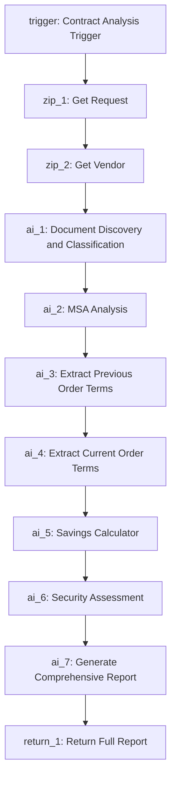

# PLAN.MD - Contract Analysis Agent

## Agent Overview

**Agent Name:** [Amplitude] Contract Analysis Agent
**Purpose:** Multi-function agent for vendor contract review workflows. Compares current requests to previous order forms/SOWs, checks for "no auto-renewals" and "price protection," flags unnegotiated or old negotiated MSAs, provides reporting on contract terms (e.g., percentage of negotiated terms, renewal dates, auto-renewals), and scans for recent security breaches or other security-related information (like SOC 2 reports) to flag for the security team.


## Node Flow Table

| Node Type | Node Name | Node ID | Purpose | Prompt / Input Logic |
| :--- | :--- | :--- | :--- | :--- |
| trigger | Contract Analysis Trigger | `trigger` | Entry point for the agent from Zip workflow. | Standard `APPROVAL_ASSIST` trigger. |
| zip | Get Request | `zip_1` | Fetch full request details including attachments. | `request_id`: `${steps.trigger.request.id}` |
| zip | Get Vendor | `zip_2` | Fetch vendor details including historical documents. | `vendor_id`: `${steps.zip_1.vendor.id}` |
| ai | Document Discovery and Classification | `ai_1` | Analyze ALL documents from request and vendor to classify types, dates, and content. | **Objective:** Act as a Document Classification Agent.<br>**Context:** Review ALL documents attached to Request ID `${steps.zip_1.id}`first and most important and then Vendor ID `${steps.zip_2.id}` For comparison the current request.<br>**Instructions:**<br>1. Identify each document by analyzing content (not filename alone).<br>2. Classify document type: MSA, Order Form, SOW, SOC 2, DPA, Security Questionnaire, Other.<br>3. Extract document date, vendor name, and key parties.<br>4. Provide brief content summary.<br>5. Assign confidence level: High, Medium, Low.<br>**Structured Output Schema:**<br>`{ "documentsOnVendor": "string", "msaFound": "boolean", "msaAge": "number or null", "previousOrderFound": "boolean", "soc2Found": "boolean", "documentsOnRequest": "string" }` |
| ai | MSA Analysis | `ai_2` | Extract and analyze MSA terms if available. | **Objective:** Act as a Senior Contract Analyst reviewing MSA terms if available.<br>**Context:** If MSA is found in `${steps.ai_1.response}`, analyze the MSA document from `${steps.ai_1.response}`. Otherwise, note that no MSA was found.<br>**Configurable Inputs:**<br>- MSA Age Threshold: 2 years<br>- Price Protection Criteria: No price increase >5% annually OR CPI-linked OR locked pricing for contract term<br>**Instructions:**<br>1. If MSA is found, extract MSA date and calculate age in years.<br>2. Flag if MSA age exceeds threshold.<br>3. Extract key terms: auto-renewal, price protection, payment terms, term length, termination clause, liability cap.<br>4. List all certifications mentioned with dates.<br>5. Assess negotiation status and risk level.<br>6. If no MSA, provide a note that MSA analysis is not available.<br>**Structured Output Schema:**<br>`{ "msaDate": "YYYY-MM-DD or null", "msaAgeYears": "number or null", "msaAgeFlag": "boolean or null", "autoRenewal": "Yes|No|Unclear or null", "priceProtection": "Yes|No|Unclear or null", "priceProtectionDetails": "string or null", "paymentTerms": "string or null", "termLength": "string or null", "terminationClause": "string or null", "liabilityCap": "string or null", "certifications": ["array"] or null, "certificationDates": "string or null", "negotiationStatus": "Negotiated|Unnegotiated|Unknown or null", "riskLevel": "High|Medium|Low or null", "msaAvailable": "boolean" }` |
| ai | Extract Previous Order Terms | `ai_3` | Extract terms from previous order form/SOW if available. | **Objective:** Act as a Contract Data Extraction Agent for previous order terms if available.<br>**Context:** If previous order is found in `${steps.ai_1.response}`, extract terms from the previous order form identified in `${steps.ai_1.response}`. Otherwise, note that no previous order was found.<br>**Instructions:**<br>1. If previous order is found, extract total price, line items, and quantities.<br>2. Extract per-unit pricing for each line item.<br>3. Extract payment terms and billing frequency.<br>4. Extract term dates (start/end).<br>5. Note any special pricing or discounts.<br>6. If no previous order, provide a note that historical comparison is not available.<br>**Structured Output Schema:**<br>`{ "totalPrice": "number or null", "lineItems": [{ "name": "string", "quantity": "number", "unitPrice": "number", "totalPrice": "number" }] or null, "perUnitPrices": [{ "item": "string", "price": "number" }] or null, "paymentTerms": "string or null", "termStartDate": "YYYY-MM-DD or null", "termEndDate": "YYYY-MM-DD or null", "specialPricing": "string or null", "discounts": "string or null", "previousOrderAvailable": "boolean" }` |
| ai | Extract Current Order Terms | `ai_4` | Extract terms from current request order form. | **Objective:** Act as a Contract Data Extraction Agent.<br>**Context:** Extract terms from the current order form in Request ID `${steps.zip_1.id}`.<br>**Instructions:**<br>1. Extract total price, line items, and quantities.<br>2. Extract per-unit pricing for each line item.<br>3. Extract payment terms and billing frequency.<br>4. Extract term dates (start/end).<br>5. Note any special pricing or discounts.<br>**Structured Output Schema:**<br>`{ "totalPrice": "number", "lineItems": [{ "name": "string", "quantity": "number", "unitPrice": "number", "totalPrice": "number" }], "perUnitPrices": [{ "item": "string", "price": "number" }], "paymentTerms": "string", "termStartDate": "YYYY-MM-DD", "termEndDate": "YYYY-MM-DD", "specialPricing": "string", "discounts": "string" }` |
| ai | Savings Calculator | `ai_5` | Dedicated node for comprehensive savings calculations if historical data is available. | **Objective:** Act as a Financial Analyst calculating savings metrics if historical data is available.<br>**Context:** If previous order terms are available from `${steps.ai_3.response}`, compare with current order terms `${steps.ai_4.response}`. Otherwise, note that no savings calculation is possible due to missing historical data.<br>**Instructions:**<br>1. If previous data is available, calculate absolute price difference.<br>2. Calculate percentage change.<br>3. Determine per-unit price changes.<br>4. Calculate annualized impact.<br>5. Project multi-year savings/costs.<br>6. Account for volume changes.<br>7. Document all calculation assumptions.<br>8. If no previous data, provide a note that savings analysis is not available.<br>**Structured Output Schema:**<br>`{ "previousTotalPrice": "number or null", "currentTotalPrice": "number", "absoluteDifference": "number or null", "percentageChange": "number or null", "savingsDirection": "Savings|Cost Increase|No Change or null", "perUnitPricePrevious": "number or null", "perUnitPriceCurrent": "number or null", "perUnitChange": "number or null", "annualizedImpact": "number or null", "multiYearProjection": "number or null", "volumeChangeFactor": "string or null", "calculationNotes": "string", "savingsCaptureReady": "boolean or null" }` |
| ai | Security Assessment | `ai_6` | Perform security research and SOC 2 analysis. | **Objective:** Act as a Security Analyst conducting vendor security assessment.<br>**Context:** Assess security posture for vendor from `${steps.zip_2.id}`.<br>**Configurable Input:** Required Certifications: `${steps.storage_3.response}`<br>**Instructions:**<br>1. Web search for recent security breaches (past 12 months).<br>2. If SOC 2 report found in `${steps.ai_1.response}`, analyze for findings.<br>3. List ALL certifications found with dates and expiration status.<br>4. Compare found certifications against required list.<br>5. Flag missing or expired critical certifications.<br>6. Identify any context-based requirements (e.g., healthcare data = HIPAA required).<br>**Structured Output Schema:**<br>`{ "recentBreaches": [{ "date": "YYYY-MM-DD", "description": "string", "severity": "Critical|High|Medium|Low" }], "certificationsFound": [{ "name": "string", "date": "YYYY-MM-DD", "expirationDate": "YYYY-MM-DD", "status": "Valid|Expired|Unknown" }], "requiredCertsPresent": "boolean", "missingCertifications": ["array"], "expiredCertifications": ["array"], "soc2Findings": "string", "securityRiskLevel": "High|Medium|Low", "securityTeamFlag": "boolean", "flagReason": "string" }` |
| ai | Generate Comprehensive Report | `ai_7` | Synthesize all findings into structured markdown report. | **Objective:** Act as a Senior Procurement Analyst generating a comprehensive contract review report.<br>**Context:** Synthesize data from Savings Calculator `${steps.ai_5.response}`, Security Assessment `${steps.ai_6.response}`, and conditionally include MSA Analysis `${steps.ai_2.response}` and previous order terms `${steps.ai_3.response}` if available.<br><br>**Report Structure:**<br><br>**1. Executive Summary:**<br>- Summary banner with color indicator based on overall risk assessment<br>  - GREEN: Low risk - proceed with standard approval<br>  - YELLOW: Medium risk - review recommended items before approval<br>  - RED: High risk - requires negotiation or security review before approval<br>- One-sentence overview of primary risk or opportunity<br>- Total contract value and savings amount if applicable<br>- Key action items requiring immediate attention<br><br>**2. Risk Scorecard Table:**<br>Generate a 4-column table with the following structure:<br>- Column 1: Status Icon - Use emoji indicators: green_circle for Low risk, yellow_circle for Medium risk, red_circle for High risk<br>- Column 2: Category - MSA Status, Pricing, Terms, Security<br>- Column 3: Summary - Brief 1-2 sentence assessment<br>- Column 4: Action Required - Yes/No with specific next step if Yes<br><br>**3. Contract Comparison Table:**<br>Generate a detailed comparison table with the following rows (include only if historical data is available):<br>- Total Contract Value: Previous vs Current vs Change percentage<br>- Per-Unit Pricing: Previous vs Current vs Change percentage<br>- License/Seat Count: Previous vs Current vs Change<br>- Auto-Renewal Clause: Previous status vs Current status vs Risk indicator<br>- Price Protection: Previous status vs Current status vs Risk indicator<br>- Payment Terms: Previous vs Current vs Change<br>- Term Length: Previous vs Current vs Change<br><br>**4. Savings Analysis Section:**<br>- Include if historical data is available; otherwise, note that savings analysis is not possible<br><br>**5. Security Assessment Section:**<br>- Certification status table: Certification Name, Issue Date, Expiration Date, Status<br>- Required certifications comparison: Required vs Present vs Gap Analysis<br>- Recent security incidents or breaches with dates and severity<br>- SOC 2 findings summary if report was analyzed<br>- Security team flag status with reason if applicable<br>- Data handling and compliance considerations<br><br>**6. Detailed Findings - Collapsible Sections:**<br>**6a. MSA Terms Review:**<br>- Include if MSA is available; otherwise, note that MSA analysis is missing<br><br>**6b. Pricing Analysis:**<br>- Line item breakdown with quantities and unit prices<br>- Discount structure and special pricing terms<br>- Overage rates and true-up provisions<br>- Price escalation clauses or CPI adjustments<br><br>**6c. Security Deep Dive:**<br>- Detailed certification analysis<br>- Security questionnaire findings if available<br>- Data residency and processing locations<br>- Sub-processor list if mentioned<br><br>**6d. Document Summary:**<br>- List of all documents analyzed with classification confidence<br>- Document age and relevance assessment<br>- Missing documents identified<br><br>**7. Recommendations Section:**<br>- Priority 1 items requiring immediate action before approval<br>- Priority 2 items recommended for negotiation<br>- Priority 3 items for future contract improvements<br>- Specific language suggestions for problematic clauses<br>- Security team escalation requirements if applicable<br>- Timeline recommendations for renegotiation if MSA is aged<br><br>**8. Appendices:**<br>- Full structured data from analysis nodes<br>- Calculation methodology details<br>- Reference to company policies applied<br><br>**Constraints:**<br>- Use professional procurement and legal terminology<br>- No conversational filler or pleasantries<br>- Ensure all markdown tables render correctly<br>- Use emoji icons that display universally<br>- All dollar amounts formatted with currency symbol and commas<br>- Percentages formatted to two decimal places<br>- Dates formatted as YYYY-MM-DD<br>- Include collapsible sections using HTML details/summary tags for lengthy content<br>- Clearly note any missing data (MSA, historical orders) and how it impacts the analysis |
| return | Return Full Report | `return_1` | Return comprehensive report with historical comparison. | **Value:** `${steps.ai_7.response}` |
| ai | Extract Current Order Terms - No Historical | `ai_8` | Extract terms from current request when no historical exists. | **Objective:** Act as a Contract Data Extraction Agent.<br>**Context:** Extract terms from the current order form in Request ID `${steps.zip_1.id}`.<br>**Instructions:** Same as `ai_4` but for branch without historical comparison.<br>**Structured Output Schema:** Same as `ai_4`. |
| ai | Security Assessment - No Historical | `ai_9` | Perform security assessment for branch without historical. | **Objective:** Same as `ai_6`.<br>**Context:** Same as `ai_6`.<br>**Structured Output Schema:** Same as `ai_6`. |
| ai | Generate Report Without Comparison | `ai_10` | Generate report for requests without historical order forms. | **Objective:** Act as a Senior Procurement Analyst generating a contract review report without historical comparison.<br>**Context:** Synthesize data from Current Order Terms `${steps.ai_8.response}`, and Security Assessment `${steps.ai_9.response}`. If MSA Analysis `${steps.ai_2.response}` is available, include it; otherwise, note that MSA is missing.<br><br>**Report Structure:**<br><br>**1. Executive Summary:**<br>- Summary banner with color indicator based on overall risk assessment<br>  - GREEN: Low risk - proceed with standard approval<br>  - YELLOW: Medium risk - review recommended items before approval<br>  - RED: High risk - requires negotiation or security review before approval<br>- One-sentence overview of primary risk or opportunity<br>- Total contract value and key commercial terms<br>- Key action items requiring immediate attention<br>- Note: No historical comparison available for this vendor<br><br>**2. Risk Scorecard Table:**<br>Generate a 4-column table with the following structure:<br>- Column 1: Status Icon - Use emoji indicators: green_circle for Low risk, yellow_circle for Medium risk, red_circle for High risk<br>- Column 2: Category - MSA Status, Pricing, Terms, Security<br>- Column 3: Summary - Brief 1-2 sentence assessment<br>- Column 4: Action Required - Yes/No with specific next step if Yes<br><br>**3. Current Contract Terms Section:**<br>- Total contract value and payment terms<br>- License/seat count and per-unit pricing<br>- Auto-renewal clause status and risk assessment<br>- Price protection status and risk assessment<br>- Term length and renewal dates<br>- Key commercial provisions<br><br>**4. Security Assessment Section:**<br>- Certification status table: Certification Name, Issue Date, Expiration Date, Status<br>- Required certifications comparison: Required vs Present vs Gap Analysis<br>- Recent security incidents or breaches with dates and severity<br>- SOC 2 findings summary if report was analyzed<br>- Security team flag status with reason if applicable<br><br>**5. Detailed Findings - Collapsible Sections:**<br>**5a. MSA Terms Review:**<br>- MSA date and age with threshold comparison<br>- Negotiation status and last negotiation date<br>- Key terms extracted: liability caps, indemnification, IP rights, termination clauses<br>- Unfavorable clauses identified with risk level<br><br>**5b. Current Pricing Analysis:**<br>- Line item breakdown with quantities and unit prices<br>- Discount structure and special pricing terms<br>- Overage rates and true-up provisions<br><br>**5c. Security Deep Dive:**<br>- Detailed certification analysis<br>- Data residency and processing locations<br><br>**5d. Document Summary:**<br>- List of all documents analyzed with classification confidence<br>- Missing documents identified<br><br>**6. Recommendations Section:**<br>- Priority 1 items requiring immediate action before approval<br>- Priority 2 items recommended for negotiation<br>- Priority 3 items for future contract improvements<br>- Request to obtain previous order forms for future comparison analysis<br><br>**Constraints:**<br>- Use professional procurement and legal terminology<br>- No conversational filler or pleasantries<br>- Ensure all markdown tables render correctly<br>- Use emoji icons that display universally<br>- All dollar amounts formatted with currency symbol and commas |
| return | Return Report - No Historical | `return_2` | Return report without historical comparison. | **Value:** `${steps.ai_10.response}` |

---

## Flow Diagram



---

## Structured Output Schemas

### Document Classification Schema (ai_1)

```json
{
  "documentsOnVendor": "string",
  "msaFound": "boolean",
  "msaAge": "number or null",
  "previousOrderFound": "boolean",
  "soc2Found": "boolean",
  "documentsOnRequest": "string"
}
```

### MSA Terms Schema (ai_2)

```json
{
  "msaDate": "YYYY-MM-DD",
  "msaAgeYears": "number",
  "msaAgeFlag": "boolean",
  "autoRenewal": "Yes|No|Unclear",
  "priceProtection": "Yes|No|Unclear",
  "priceProtectionDetails": "string",
  "paymentTerms": "string",
  "termLength": "string",
  "terminationClause": "string",
  "liabilityCap": "string",
  "certifications": ["array"],
  "certificationDates": "string",
  "negotiationStatus": "Negotiated|Unnegotiated|Unknown",
  "riskLevel": "High|Medium|Low"
}
```

### Savings Calculation Schema (ai_5)

```json
{
  "previousTotalPrice": "number",
  "currentTotalPrice": "number",
  "absoluteDifference": "number",
  "percentageChange": "number",
  "savingsDirection": "Savings|Cost Increase|No Change",
  "perUnitPricePrevious": "number or null",
  "perUnitPriceCurrent": "number or null",
  "perUnitChange": "number or null",
  "annualizedImpact": "number",
  "multiYearProjection": "number",
  "volumeChangeFactor": "string",
  "calculationNotes": "string",
  "savingsCaptureReady": "boolean"
}
```

### Security Assessment Schema (ai_6, ai_9, ai_12)

```json
{
  "recentBreaches": [
    {
      "date": "YYYY-MM-DD",
      "description": "string",
      "severity": "Critical|High|Medium|Low"
    }
  ],
  "certificationsFound": [
    {
      "name": "string",
      "date": "YYYY-MM-DD",
      "expirationDate": "YYYY-MM-DD",
      "status": "Valid|Expired|Unknown"
    }
  ],
  "requiredCertsPresent": "boolean",
  "missingCertifications": ["array"],
  "expiredCertifications": ["array"],
  "soc2Findings": "string",
  "securityRiskLevel": "High|Medium|Low",
  "securityTeamFlag": "boolean",
  "flagReason": "string"
}
```

---

## Justifications

1. **Strict ID Ordering**: All nodes follow the mandatory `ai_n`, `zip_n`, `condition_n`, `return_n` sequential naming convention.

2. **Configurable Variables**: Hardcoded values in prompts allow thresholds and criteria to be updated by editing the agent.

3. **Robust Document Handling**: `ai_1` analyzes document content (not just filenames) with confidence levels and failsafe classification.

4. **Dedicated Savings Node**: `ai_5` is a dedicated calculation node with structured output ensuring consistent, comprehensive savings metrics.

5. **Flexible Certification Handling**: Security assessments list ALL certifications found, compare against configurable required list, and flag context-based requirements.

6. **Sequential Logic**: Linear flow with conditional processing:
    - All steps execute in sequence, with each step handling missing data gracefully
    - MSA and historical analysis included if available, otherwise noted as missing

7. **Security Integration**: Web research for breaches, SOC 2 analysis, and certification tracking with security team flagging capability.

8. **Extensibility**: Savings capture can be extended to write to Zip custom fields by adding an HTTP step or Python node post-import.

---

## Future Enhancement Notes

1. **Savings Capture to Zip Field**: Add `python_1` node to generate interactive button for writing savings to custom field (requires field GUID configuration post-import).

2. **Cross-Vendor Reporting**: Agent runs per-request; for cross-vendor analytics, implement a separate reporting layer that aggregates stored data.

3. **Security Team Routing**: Add conditional logic to reassign approval node to security team if `securityTeamFlag` is true.
